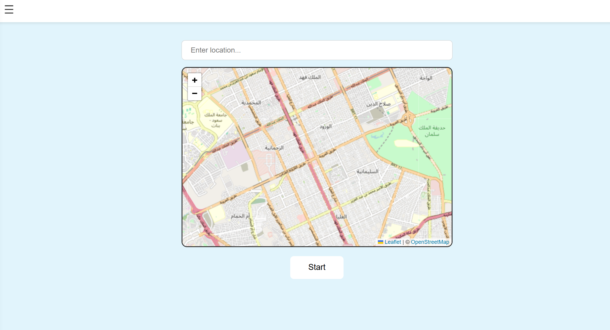
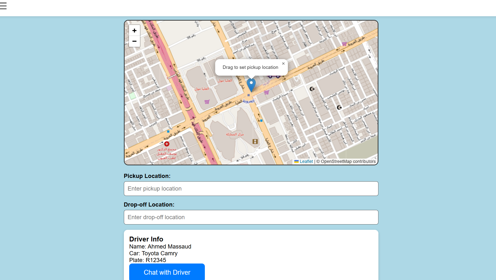

# Ridesharing-web
*Project OverView 

This project is a student delivery website designed to help students move around campus quickly and safely . It was developed as a part of Software Engineering 1 and will be expanded in Engineering 2. The website uses frontend and backend technologies,incliding APIs to handle data communication efficiently .

*Project Screenshots 

*Team Members and roles 

This project was developed by a team of 7 members, each with a specific role:

Sarah alotaibi/ Frontend Developer ,Designer

Danyah bin doukhi/ Frontend Developer and APIs integration

Renad Alyami/ Backend Developer , Database Management

Lamia Alanazi/ Backend Developer , Database Management

Noura Almedlej/ Testing

Rama Alarbeed/Testing 

Reham/Documentation

*Next steps 

-Continue developing the project in Engineering 2
-Add new features such as order tracking and improved user experinece .

